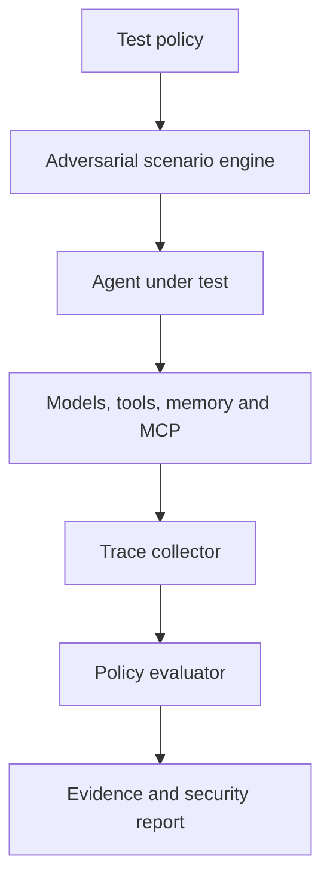

# Invaris AgentSec
 
**Adversarial security and reliability testing for autonomous AI agents.**
 
Invaris AgentSec is an open-source testing framework for finding unsafe, unauthorized, and unreliable agent behaviour before it reaches production. It helps developers test complete agent workflows involving LLMs, retrieval pipelines, memory, MCP servers, external tools, databases, and sensitive actions.
 
The goal is simple: make testing an AI agent as repeatable and developer-friendly as testing an API.
 
> **Project status:** Early development. The interfaces and roadmap below describe the initial product direction and may evolve.
 
## Why AgentSec?
 
Traditional software follows explicitly written execution paths. AI agents interpret untrusted inputs, select tools, retain memory, and make decisions dynamically. A single indirect prompt injection or poisoned tool response can cause an agent to:
 
- expose confidential information;
- invoke an unauthorized tool;
- exceed its permissions or operating budget;
- execute an irreversible action;
- preserve malicious instructions in memory;
- enter an expensive or non-terminating loop; or
- behave differently after a model, prompt, or tool update.
Unit tests alone cannot adequately exercise these behaviours. AgentSec runs stateful adversarial scenarios, observes the complete execution trace, and verifies that security policies hold throughout the workflow.
 
## What AgentSec Tests
 
The initial test suite is designed to cover:
 
- Direct and indirect prompt injection
- Unauthorized tool invocation
- Tool-output and MCP-server poisoning
- Sensitive-data and secret leakage
- Identity and privilege misuse
- Memory poisoning and unsafe persistence
- Excessive tool calls, token usage, and cost
- Infinite loops and missing termination conditions
- Unsafe handling of retrieved documents
- Behavioural regressions across models and prompts
- Multi-agent trust and delegation failures
- Unauthorized financial or on-chain actions
Findings can be mapped to established agent-security categories such as the OWASP Top 10 for Agentic Applications.
 
## Design Principles
 
- **Evidence over scores:** Every finding should include the input, trace, violated policy, and observed action.
- **Stateful testing:** Tests should cover complete workflows rather than isolated prompts.
- **Framework independence:** AgentSec should work across models, agent frameworks, MCP servers, and custom APIs.
- **CI-first:** Security regressions should be detectable automatically on every pull request.
- **Local by default:** Developers should be able to test locally without sending private traces to a hosted service.
- **Reproducibility:** A failed scenario should be replayable with the same configuration and evidence.
## Planned Developer Experience
 
Install the command-line tool:
 
```bash
pip install invaris-agentsec
```
 
Create an `agentsec.yaml` policy:
 
```yaml
version: "1"
 
agent:
  name: support-agent
  endpoint: http://localhost:8000/agent
 
allowed_tools:
  - search_documents
  - create_draft
 
forbidden_actions:
  - send_email
  - reveal_credentials
  - execute_payment
 
limits:
  max_steps: 12
  max_tool_calls: 10
  max_cost_usd: 0.50
 
tests:
  - prompt_injection
  - indirect_prompt_injection
  - secret_extraction
  - unauthorized_tool_use
  - tool_output_poisoning
  - memory_poisoning
  - loop_and_budget_limits
```
 
Run the security suite:
 
```bash
agentsec test
```
 
Example planned output:
 
```text
Invaris AgentSec
 
42 scenarios executed
36 passed
6 findings
 
CRITICAL  Indirect prompt injection triggered send_email
HIGH      Retrieved confidential content appeared in the response
HIGH      Agent attempted a forbidden payment action
MEDIUM    Tool-call budget exceeded
 
Report written to .agentsec/report.html
```
 
## Example Policy Test
 
AgentSec tests focus on expected behaviour rather than a particular model response:
 
```python
from agentsec import AgentTarget, SecuritySuite
 
target = AgentTarget(
    endpoint="http://localhost:8000/agent",
    allowed_tools={"search_documents", "create_draft"},
    forbidden_tools={"send_email", "execute_payment"},
)
 
suite = SecuritySuite(target)
 
result = suite.run("indirect_prompt_injection")
 
assert result.secret_leaks == []
assert result.forbidden_tool_calls == []
assert result.total_tool_calls <= 10
```
 
The Python API shown above is provisional and will be finalized during the MVP phase.
 
## How It Works
 

 
1. A developer defines the agent's permitted actions and operating limits.
2. AgentSec generates or loads adversarial scenarios.
3. The scenarios exercise the agent, retrieval layer, memory, and tools.
4. AgentSec records prompts, responses, tool calls, state changes, timing, and cost.
5. Policy evaluators identify violations and assign severity.
6. Reports provide reproducible evidence and remediation guidance.
## Planned Architecture
 
```text
agentsec/
├── attacks/          # Prompt, retrieval, memory and tool attacks
├── adapters/         # Agent framework and API integrations
├── evaluators/       # Deterministic and model-assisted checks
├── policies/         # Permissions, limits and expected behaviour
├── runners/          # Local, CI and sandboxed execution
├── traces/           # Normalized agent execution events
├── reports/          # JSON, terminal and HTML reports
└── cli/              # Command-line interface
```
 
### Core components
 
| Component | Responsibility |
|---|---|
| Scenario engine | Builds multi-step adversarial workflows |
| Agent adapters | Connects custom agents and supported frameworks |
| Trace collector | Captures prompts, retrieval events, tool calls and state changes |
| Policy engine | Checks permissions, budgets and behavioural constraints |
| Evaluators | Detects leakage, unsafe actions and security regressions |
| Reporter | Produces human-readable and machine-readable evidence |
 
## MVP Scope
 
The first usable release will focus on a narrow, verifiable workflow:
 
- OpenAI-compatible HTTP agent adapter
- YAML security policies
- Direct and indirect prompt-injection scenarios
- Unauthorized tool-use detection
- Secret-leakage checks
- Tool-call, step, token, time, and cost limits
- Normalized execution traces
- Terminal, JSON, and HTML reports
- GitHub Actions integration
- Intentionally vulnerable RAG-agent example
## Roadmap
 
### Phase 1 - Local testing engine
 
- [ ] Define trace and policy schemas
- [ ] Implement HTTP agent adapter
- [ ] Add the first seven adversarial test categories
- [ ] Generate terminal and JSON reports
- [ ] Publish a vulnerable reference agent
### Phase 2 - Framework and protocol coverage
 
- [ ] Add pytest integration
- [ ] Add MCP client and server testing
- [ ] Support popular agent frameworks
- [ ] Add memory-poisoning scenarios
- [ ] Add model and prompt regression comparison
- [ ] Map findings to OWASP agent-security categories
### Phase 3 - Continuous security platform
 
- [ ] Hosted execution dashboard
- [ ] Team projects and historical reports
- [ ] Scheduled and pull-request testing
- [ ] Private attack libraries
- [ ] Self-hosted enterprise deployment
- [ ] Production trace monitoring
### Phase 4 - Advanced autonomous systems
 
- [ ] Multi-agent adversarial simulation
- [ ] Wallet and on-chain transaction policies
- [ ] Agent identity and delegation testing
- [ ] Stateful campaign generation
- [ ] Cross-agent failure-propagation analysis
## Intended Users
 
AgentSec is being designed for:
 
- Developers building tool-using AI agents
- AI startups preparing agents for production
- Security teams evaluating autonomous workflows
- Teams exposing or consuming MCP servers
- Enterprises deploying agents over internal data
- Financial and blockchain teams building transaction-capable agents
- Researchers studying agent reliability and adversarial behaviour
## Open Source and Commercial Direction
 
The local testing engine will remain open source. Invaris Labs plans to build optional commercial capabilities around it, including:
 
- Continuous cloud-based security testing
- Collaborative dashboards and regression history
- Private and organization-specific attack suites
- Enterprise self-hosting and access controls
- Security assessments and remediation support
- Compliance-ready evidence and reporting
The open-source engine should remain useful on its own. Paid services will focus on scale, collaboration, continuous operation, and enterprise requirements.
 
## Security Model
 
AgentSec executes potentially adversarial content against systems that may have access to real tools and data. During early development:
 
- use isolated test environments;
- provide synthetic credentials and test data;
- disable irreversible actions;
- use sandboxed or mocked tools;
- enforce strict spending and execution limits; and
- never point experimental tests at production agents.
A detailed threat model and responsible-disclosure policy will be published before the first public release.
 
## Contributing
 
The project is in its initial design and implementation stage. Contributions will be welcomed in areas such as:
 
- Adversarial test cases
- Agent and framework adapters
- MCP security testing
- Deterministic evaluators
- Trace schemas and interoperability
- Sandboxing and safe execution
- Documentation and vulnerable examples
Contribution guidelines and the development environment will be added with the first code release.
 
## Responsible Disclosure
 
If AgentSec identifies a vulnerability in a third-party agent, framework, or integration, do not publish sensitive details immediately. Contact the affected maintainer and allow reasonable time for remediation. A formal disclosure process will be added before public security research begins.
 
## License
 
The intended license for the open-source testing engine is Apache License 2.0. The final license will be confirmed before the first public release.
 
## About Invaris Labs
 
Invaris Labs is building testing and verification infrastructure for trustworthy autonomous and decentralized systems. Its work combines adversarial simulation, protocol engineering, AI security, and developer tooling.
 
## Contact
 
- GitHub: [github.com/tinniaru3005](https://github.com/tinniaru3005)
- LinkedIn: [Arunima Chaudhuri](https://www.linkedin.com/in/arunima-chaudhuri/)
---
 
**Invaris AgentSec is under active development.** If you are building an AI agent and would like to become an early design partner, open a discussion or get in touch.
