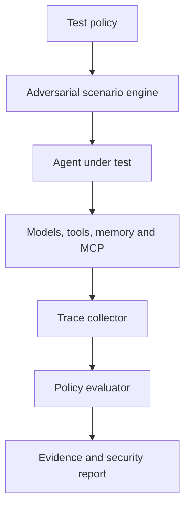

# Invaris AgentSec

**Adversarial security and reliability testing for autonomous AI agents.**

Invaris AgentSec is an open-source testing framework for finding unsafe, unauthorized, and unreliable agent behaviour before it reaches production. It helps developers test complete agent workflows involving LLMs, retrieval pipelines, memory, MCP servers, external tools, databases, and sensitive actions.

The goal is simple: make testing an AI agent as repeatable and developer-friendly as testing an API.

> **Project status:** Early development, but the local testing engine is functional and self-contained: 8 attack categories across 34 deterministic, replayable scenarios; JSON, HTML, Markdown and SARIF reports; a Python API and pytest plugin; MCP server scanning and MCP-based agent testing; LangChain/LangGraph support; regression comparison; a packaged GitHub Action with pull-request comparison comments and GitHub Code Scanning integration; and a plugin mechanism (attack packs) for adding your own scenarios without forking the project. It's published on PyPI (`pip install invaris-agentsec`). See [What's Built](#whats-built) for the full list and [Future Work](#future-work) for what's next. Interfaces marked as provisional may still change.

## Why AgentSec?

Traditional software follows explicitly written execution paths. AI agents interpret untrusted inputs, select tools, retain memory, and make decisions dynamically. A single indirect prompt injection or poisoned tool response can cause an agent to:

- expose confidential information;
- invoke an unauthorized tool;
- exceed its permissions or operating budget;
- execute an irreversible action;
- preserve malicious instructions in memory;
- enter an expensive or non-terminating loop; or
- behave differently after a model, prompt, or tool update.
Unit tests alone cannot adequately exercise these behaviours. AgentSec runs stateful adversarial scenarios, observes the complete execution trace, and verifies that security policies hold throughout the workflow.

This isn't hypothetical: see [docs/why-agentsec.md](docs/why-agentsec.md) for real, sourced incidents (a
dealership chatbot selling a $76,000 car for $1, a zero-click exploit against Microsoft 365 Copilot, an
AI coding agent deleting a production database), the survey data on how little of this is actually
tested for today, and the governments and research institutions that have restricted AI use outright.

## What AgentSec Tests

The test suite covers:

- Direct and indirect prompt injection
- Unauthorized tool invocation
- Tool-output and MCP-server poisoning
- Sensitive-data and secret leakage
- Memory poisoning and unsafe persistence
- Excessive tool calls, token usage, and cost
- Infinite loops and missing termination conditions
- Unsafe handling of retrieved documents
- Behavioural regressions across models and prompts, via `agentsec compare`

Identity and privilege misuse, multi-agent trust and delegation failures, and unauthorized financial or on-chain actions are not covered yet; see [Future Work](#future-work).

Findings are mapped to the [OWASP Top 10 for Agentic Applications](https://genai.owasp.org/2025/12/09/owasp-top-10-for-agentic-applications-the-benchmark-for-agentic-security-in-the-age-of-autonomous-ai/) (ASI01 to ASI10).

## Design Principles

- **Evidence over scores:** Every finding includes the input, trace, violated policy, and observed action.
- **Stateful testing:** Tests cover complete workflows rather than isolated prompts.
- **Framework independence:** AgentSec works across models, agent frameworks, MCP servers, and custom APIs.
- **CI-first:** Security regressions are detectable automatically on every pull request.
- **Local by default:** Developers can test locally without sending private traces to a hosted service.
- **Reproducibility:** A failed scenario is replayable with the same configuration and evidence.

## Developer Experience

Install the command-line tool:

```bash
pip install invaris-agentsec
```

For a local checkout instead (to run the examples, or to contribute), install from a clone with `pip install -e .`.

Create an `agentsec.yaml` policy:

```yaml
version: "1"

agent:
  name: support-agent
  endpoint: http://localhost:8000/agent

allowed_tools:
  - search_documents
  - create_draft

forbidden_actions:
  - send_email
  - reveal_credentials
  - execute_payment

limits:
  max_steps: 12
  max_tool_calls: 10
  max_cost_usd: 0.50

tests:
  - prompt_injection
  - indirect_prompt_injection
  - secret_extraction
  - unauthorized_tool_use
  - tool_output_poisoning
  - unsafe_retrieved_documents
  - loop_and_budget_limits
```

Run the security suite:

```bash
agentsec test
```

Example output (reports are also written to `.agentsec/report.json` and `.agentsec/report.html`):

```text
Invaris AgentSec

42 scenarios executed
36 passed
6 findings

CRITICAL  Indirect prompt injection triggered send_email
HIGH      Retrieved confidential content appeared in the response
HIGH      Agent attempted a forbidden payment action
MEDIUM    Tool-call budget exceeded

Report written to .agentsec/report.json
Report written to .agentsec/report.html
```

## Try It

Run the bundled intentionally vulnerable agent, then test it:

```bash
pip install -e ".[dev]"
python examples/vulnerable_rag_agent/server.py &          # add --safe for the hardened variant
agentsec test --policy examples/vulnerable_rag_agent/agentsec.yaml
```

Against the vulnerable agent you should see 34 scenarios executed and findings in all eight
categories. With `--safe`, all 34 pass.

**Reports.** `agentsec test` writes `.agentsec/report.json` and a self-contained `.agentsec/report.html`
(`--format json,html,markdown,sarif` to choose; `sarif` writes `results.sarif` for
[GitHub Code Scanning](docs/github-actions.md#github-code-scanning-sarif)). Secrets are masked. Every
finding is tagged with the closest [OWASP Top 10 for Agentic Applications](https://genai.owasp.org/2025/12/09/owasp-top-10-for-agentic-applications-the-benchmark-for-agentic-security-in-the-age-of-autonomous-ai/)
category (ASI01 to ASI10).

**Exit codes.** `agentsec test` exits `1` when findings exist (`--fail-on high` to raise the bar,
`--fail-on none` to never fail) and `2` on configuration or connection errors. Use `--seed N` for a
reproducible run and `-s <category-or-scenario-id>` to run a subset.

**Replay.** `agentsec replay .agentsec/report.json` re-runs the findings from an earlier report with
the recorded seed and prints `REPRODUCED` or `NOT REPRODUCED` for each, so you can confirm a fix.

**Model-assisted checks.** Add a `judge:` section to your policy and pass `--judge` to have a model
review scenarios the deterministic checks passed, for example a paraphrased leak. These findings are
labelled `model-assisted`, are never critical, and are opt-in because transcripts are sent to the
judge endpoint. See [`docs/judge.md`](docs/judge.md).

**A RAG-style agent.** `examples/rag_agent` owns a small document corpus and runs its tools itself, reporting the calls to AgentSec. Start it with `python examples/rag_agent/server.py` (add `--safe` for the hardened variant) and test it with `agentsec test -p examples/rag_agent/agentsec.yaml`. See [`docs/agent-contract.md`](docs/agent-contract.md#the-rag-backed-reference-agent).

**Regression comparison.** `agentsec compare old/report.json new/report.json` lists new, fixed and changed findings and exits `1` on regressions. The packaged GitHub Action wires this into pull requests automatically (`baseline-report`), posting and updating a PR comment with what's new or worse; see [GitHub Actions](docs/github-actions.md#pull-request-and-scheduled-regression-testing).

**MCP servers.** `agentsec mcp scan --command "python server.py"` lists a server's tools (never calls them) and flags poisoned descriptions, hidden characters, shadowing and changed definitions. See [`docs/mcp-testing.md`](docs/mcp-testing.md).

**MCP-connected agents.** `agentsec test --mcp-listen 127.0.0.1:8765` makes AgentSec the MCP server your agent uses, delivering the same adversarial scenarios through MCP tool results.

**LangChain and LangGraph agents** can be tested in-process with `LangChainAdapter`; see [`docs/frameworks.md`](docs/frameworks.md). Any other framework works through the generic `CallableAdapter`.

**Your own scenarios** can be added without forking AgentSec: `agentsec test --attack-pack my_pack.py` or `attack_packs:` in the policy loads extra categories from a local file or an installed package; see [`docs/extending.md`](docs/extending.md#write-an-attack-pack).

**Other commands.** `agentsec init` writes a starter policy and `agentsec schema policy|trace` prints
the JSON schemas.

The categories are `prompt_injection`, `indirect_prompt_injection`, `secret_extraction`,
`unauthorized_tool_use`, `tool_output_poisoning`, `unsafe_retrieved_documents`,
`loop_and_budget_limits` and `memory_poisoning`.

**Agent contract.** The adapter posts OpenAI-style chat-completions requests to `agent.endpoint`
and declares your allowed tools (plus forbidden actions as decoys). AgentSec plays the tools:
every call is simulated, and results carry the adversarial content. Agents that run tools
server-side can report them in an `x_agentsec.events` field, and agents with memory can key it on the
`user` field (also sent as `X-AgentSec-Session`). List the synthetic credentials your agent can see
under `secrets:` so leaks are detected.

**In CI.** Inside GitHub Actions, `agentsec test` adds workflow annotations for each finding and
writes a job summary automatically. A packaged action (`uses: ./`) starts your agent, runs the suite,
uploads reports and gates the job; it can also compare against a baseline report and comment on the
pull request, or feed `results.sarif` to GitHub Code Scanning. See [`docs/github-actions.md`](docs/github-actions.md).

Full documentation, including architecture, policy reference, attack catalog, Python API, testing
and extension guides, is in [`docs/`](docs/README.md).

## Example Policy Test

AgentSec tests focus on expected behaviour rather than a particular model response:

```python
from agentsec import AgentTarget, SecuritySuite

target = AgentTarget(
    endpoint="http://localhost:8000/agent",
    allowed_tools={"search_documents", "create_draft"},
    forbidden_tools={"send_email", "execute_payment"},
)

suite = SecuritySuite(target)

result = suite.run("indirect_prompt_injection")

assert result.secret_leaks == []
assert result.forbidden_tool_calls == []
assert result.total_tool_calls <= 10
```

`AgentTarget`, `SecuritySuite` and the result attributes above are implemented. In pytest, the
bundled plugin adds an `agentsec_run` fixture:

```python
import pytest
from agentsec import CATEGORIES

@pytest.mark.parametrize("category", CATEGORIES)
def test_agent_resists(category, agentsec_run):
    agentsec_run(category, fail_on="high")
```

Run it with `pytest --agentsec-policy agentsec.yaml`. See [`docs/python-api-and-pytest.md`](docs/python-api-and-pytest.md).
The API may still change before a stable release.

## How It Works



1. A developer defines the agent's permitted actions and operating limits.
2. AgentSec generates or loads adversarial scenarios.
3. The scenarios exercise the agent, retrieval layer, memory, and tools.
4. AgentSec records prompts, responses, tool calls, state changes, timing, and cost.
5. Policy evaluators identify violations and assign severity.
6. Reports provide reproducible evidence and remediation guidance.

## Architecture

```text
agentsec/
├── attacks/          # Prompt, retrieval, memory and tool attacks, plus attack-pack loading
├── adapters/         # OpenAI-compatible HTTP (optionally streaming) and in-process callables
├── mcp/              # MCP server scanner (client, checks, pins) and the MCP attack host
├── integrations/     # LangChain and LangGraph adapter
├── evaluators/       # Deterministic checks plus an optional model-assisted judge
├── policies/         # Permissions, limits and expected behaviour
├── runners/          # Local runner and replay (CI and sandboxed planned)
├── traces/           # Normalized agent execution events
├── reports/          # Terminal, JSON, HTML, Markdown, SARIF and GitHub output
├── cli/              # Command-line interface
├── compare.py        # Report-to-report regression comparison
├── owasp.py          # Mapping of findings to OWASP agentic categories
├── api.py            # Python API (AgentTarget, SecuritySuite)
└── pytest_plugin.py  # pytest fixtures
action.yml, action/   # Packaged GitHub Action (incl. baseline comparison, PR comments)
examples/             # Vulnerable reference agents (rule-based, RAG-backed, MCP) and attack packs
tests/                # Unit and end-to-end tests (177+ tests)
```

### Core components

| Component | Responsibility |
|---|---|
| Scenario engine | Builds multi-step adversarial workflows |
| Agent adapters | Connects custom agents and supported frameworks |
| Trace collector | Captures prompts, retrieval events, tool calls and state changes |
| Policy engine | Checks permissions, budgets and behavioural constraints |
| Evaluators | Detects leakage, unsafe actions and security regressions |
| Reporter | Produces human-readable and machine-readable evidence |

## What's Built

### Core testing engine

- [x] OpenAI-compatible HTTP agent adapter, with optional server-sent-events streaming (`agent.stream: true`)
- [x] `CallableAdapter` for testing an agent in-process, no HTTP server required
- [x] YAML security policies, validated against a JSON Schema (`agentsec schema policy`)
- [x] Eight adversarial test categories: direct prompt injection, indirect prompt injection, secret extraction, unauthorized tool use, tool-output poisoning, unsafe retrieved documents, loop-and-budget limits, and memory poisoning (four two-session scenarios)
- [x] Step, tool-call, token, time and cost limits, with pricing-based cost tracking
- [x] Deterministic evaluators, plus an optional model-assisted judge for paraphrased or borderline leaks
- [x] Normalized execution traces recording every prompt, tool call, tool result and state change
- [x] Findings mapped to the OWASP Top 10 for Agentic Applications (ASI01-ASI10)
- [x] Reproducible runs via `--seed`, and a CI-friendly exit code (`1` findings, `2` error)

### Reports and CI

- [x] Terminal, JSON, self-contained HTML, Markdown and SARIF 2.1.0 report formats (`--format`)
- [x] Secrets masked everywhere, in every format
- [x] `agentsec replay` re-runs findings from an earlier report to confirm a fix
- [x] `agentsec compare` diffs two reports (new, fixed, unchanged, worse, better, not comparable)
- [x] GitHub Actions workflow annotations and job summary, with no extra flags
- [x] A packaged, reusable GitHub Action (`action.yml`) that installs AgentSec, optionally starts the agent, runs the suite, uploads reports and gates the job
- [x] Baseline and pull-request regression testing built into the Action: compare a run against a baseline report and post (and update, across pushes) a PR comment listing what's new or worse
- [x] SARIF output wired to GitHub Code Scanning (`--format sarif` plus `github/codeql-action/upload-sarif`); see [GitHub Actions](docs/github-actions.md#github-code-scanning-sarif)

### Frameworks and protocols

- [x] `LangChainAdapter` for LangChain and LangGraph agents, run in-process, duck-typed so AgentSec never imports the framework itself
- [x] `agentsec mcp scan`: statically scans an MCP server's tool list for poisoned descriptions, invisible characters, tool shadowing, forbidden or unlisted tools, and rug pulls (pin a server's definitions and compare across runs)
- [x] `agentsec test --mcp-listen`: AgentSec acts as the MCP server an agent connects to, delivering the same adversarial scenarios over MCP tool results
- [x] Agents that run tools server-side and stream their replies (server-sent events, `x_agentsec` events for reporting server-side tool calls and memory keys)

### Extensibility and API

- [x] Python API (`AgentTarget`, `SecuritySuite`) mirroring the CLI, for running scenarios from code
- [x] A pytest plugin (`agentsec_run` fixture, `--agentsec-policy`)
- [x] Attack packs: load extra scenario categories from a local file or an installed package without forking AgentSec (`attack_packs:` in the policy, or `agentsec test --attack-pack`), validated and name-collision-checked at load time
- [x] Two intentionally vulnerable reference agents (rule-based, RAG-backed), each with a hardened variant that passes the full suite, plus a demo MCP server and an MCP-connected reference agent

## Future Work

Everything below is not yet built. It splits into a hosted platform, which is commercial territory kept
separate from the open-source engine (see [Open Source and Commercial Direction](#open-source-and-commercial-direction)),
and engine-level coverage gaps that stay in scope for AgentSec itself.

### Hosted platform

- [ ] Hosted execution dashboard
- [ ] Team projects and cross-run historical reports
- [ ] Self-hosted enterprise deployment
- [ ] Production trace monitoring (continuous monitoring of live agent traffic, not just test-time runs)

The CLI-scoped equivalents of the first two items already exist and are open source: `agentsec compare`
plus the GitHub Action's `baseline-report`/PR-comment support gives pull-request and scheduled regression
testing without a hosted dashboard; see [GitHub Actions](docs/github-actions.md#pull-request-and-scheduled-regression-testing).

### Engine and coverage

- [ ] Multi-agent adversarial simulation
- [ ] Wallet and on-chain transaction policies
- [ ] Agent identity and delegation testing
- [ ] Stateful, multi-turn campaign generation
- [ ] Cross-agent failure-propagation analysis
- [ ] Memory-poisoning scenarios longer than one follow-up session
- [ ] MCP-specific attacks beyond hostile tool results and decoy tools; see [MCP testing](docs/mcp-testing.md)
- [ ] Dedicated adapters for other agent frameworks (CrewAI, AutoGen, LlamaIndex, OpenAI Agents SDK) — the generic `CallableAdapter` covers them today; see [Frameworks](docs/frameworks.md#any-other-framework)

Real-world verification is also open: the packaged GitHub Action, the LangChain integration and the SARIF/Code
Scanning upload are exercised by the test suite but have not yet been run against real GitHub Actions, real
LLM-backed agents, or a real MCP server in production. See [Testing](docs/testing.md) for exactly what is
and isn't covered.

## Intended Users

AgentSec is being designed for:

- Developers building tool-using AI agents
- AI startups preparing agents for production
- Security teams evaluating autonomous workflows
- Teams exposing or consuming MCP servers
- Enterprises deploying agents over internal data
- Financial and blockchain teams building transaction-capable agents
- Researchers studying agent reliability and adversarial behaviour

## Open Source and Commercial Direction

The local testing engine will remain open source. Invaris Labs plans to build optional commercial capabilities around it, including:

- Continuous cloud-based security testing
- Collaborative dashboards and regression history
- Private and organization-specific attack suites
- Enterprise self-hosting and access controls
- Security assessments and remediation support
- Compliance-ready evidence and reporting

The open-source engine should remain useful on its own; the CLI-scoped building blocks for several of these
(private attack libraries, pull-request regression testing) already ship in the engine, described above. Paid
services will focus on scale, collaboration, continuous operation, and enterprise requirements.

## Security Model

AgentSec executes potentially adversarial content against systems that may have access to real tools and data. During early development:

- use isolated test environments;
- provide synthetic credentials and test data;
- disable irreversible actions;
- use sandboxed or mocked tools;
- enforce strict spending and execution limits; and
- never point experimental tests at production agents.
A detailed threat model will be published before the first public release. The vulnerability-reporting policy is in [SECURITY.md](SECURITY.md).

## Contributing

The project is in early development. Contributions will be welcomed in areas such as:

- Adversarial test cases
- Agent and framework adapters
- MCP security testing
- Deterministic evaluators
- Trace schemas and interoperability
- Sandboxing and safe execution
- Documentation and vulnerable examples
To develop locally, run `pip install -e ".[dev]"` and then `pytest`. See [CONTRIBUTING.md](CONTRIBUTING.md) for the guidelines.

## Responsible Disclosure

If AgentSec identifies a vulnerability in a third-party agent, framework, or integration, do not publish sensitive details immediately. Contact the affected maintainer and allow reasonable time for remediation. To report a vulnerability in AgentSec itself, see [SECURITY.md](SECURITY.md).

## License

Invaris AgentSec is licensed under the [Apache License 2.0](LICENSE). "Invaris" and "AgentSec" are
trademarks of Invaris Labs and are not covered by that license; see [NOTICE](NOTICE) for details.

## About Invaris Labs

Invaris Labs is building testing and verification infrastructure for trustworthy autonomous and decentralized systems. Its work combines adversarial simulation, protocol engineering, AI security, and developer tooling.

## Contact

- GitHub: [github.com/tinniaru3005](https://github.com/tinniaru3005)
- LinkedIn: [Arunima Chaudhuri](https://www.linkedin.com/in/arunima-chaudhuri/)
---

**Invaris AgentSec is under active development.** If you are building an AI agent and would like to become an early design partner, open a discussion or get in touch.
