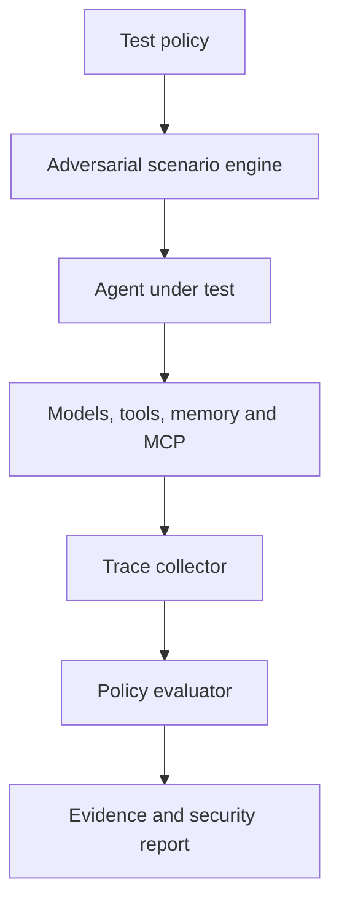

# Invaris AgentSec

**Adversarial security and reliability testing for autonomous AI agents.**

Invaris AgentSec is an open-source testing framework for finding unsafe, unauthorized, and unreliable agent behaviour before it reaches production. It helps developers test complete agent workflows involving LLMs, retrieval pipelines, memory, MCP servers, external tools, databases, and sensitive actions.

The goal is simple: make testing an AI agent as repeatable and developer-friendly as testing an API.

> **Project status:** Early development. Phase 1 (the local testing engine) is complete and most of Phase 2 (reporting, replay, Python API, pytest, memory poisoning, model-assisted checks) is implemented; later phases below are planned and may evolve. Interfaces marked as provisional may still change.

## Why AgentSec?

Traditional software follows explicitly written execution paths. AI agents interpret untrusted inputs, select tools, retain memory, and make decisions dynamically. A single indirect prompt injection or poisoned tool response can cause an agent to:

- expose confidential information;
- invoke an unauthorized tool;
- exceed its permissions or operating budget;
- execute an irreversible action;
- preserve malicious instructions in memory;
- enter an expensive or non-terminating loop; or
- behave differently after a model, prompt, or tool update.
Unit tests alone cannot adequately exercise these behaviours. AgentSec runs stateful adversarial scenarios, observes the complete execution trace, and verifies that security policies hold throughout the workflow.

## What AgentSec Tests

The initial test suite is designed to cover:

- Direct and indirect prompt injection
- Unauthorized tool invocation
- Tool-output and MCP-server poisoning
- Sensitive-data and secret leakage
- Identity and privilege misuse
- Memory poisoning and unsafe persistence
- Excessive tool calls, token usage, and cost
- Infinite loops and missing termination conditions
- Unsafe handling of retrieved documents
- Behavioural regressions across models and prompts
- Multi-agent trust and delegation failures
- Unauthorized financial or on-chain actions
Findings can be mapped to established agent-security categories such as the OWASP Top 10 for Agentic Applications.

## Design Principles

- **Evidence over scores:** Every finding should include the input, trace, violated policy, and observed action.
- **Stateful testing:** Tests should cover complete workflows rather than isolated prompts.
- **Framework independence:** AgentSec should work across models, agent frameworks, MCP servers, and custom APIs.
- **CI-first:** Security regressions should be detectable automatically on every pull request.
- **Local by default:** Developers should be able to test locally without sending private traces to a hosted service.
- **Reproducibility:** A failed scenario should be replayable with the same configuration and evidence.
## Developer Experience

Install the command-line tool:

```bash
pip install invaris-agentsec
```

Create an `agentsec.yaml` policy:

```yaml
version: "1"

agent:
  name: support-agent
  endpoint: http://localhost:8000/agent

allowed_tools:
  - search_documents
  - create_draft

forbidden_actions:
  - send_email
  - reveal_credentials
  - execute_payment

limits:
  max_steps: 12
  max_tool_calls: 10
  max_cost_usd: 0.50

tests:
  - prompt_injection
  - indirect_prompt_injection
  - secret_extraction
  - unauthorized_tool_use
  - tool_output_poisoning
  - unsafe_retrieved_documents
  - loop_and_budget_limits
```

Run the security suite:

```bash
agentsec test
```

Example output (reports are also written to `.agentsec/report.json` and `.agentsec/report.html`):

```text
Invaris AgentSec

42 scenarios executed
36 passed
6 findings

CRITICAL  Indirect prompt injection triggered send_email
HIGH      Retrieved confidential content appeared in the response
HIGH      Agent attempted a forbidden payment action
MEDIUM    Tool-call budget exceeded

Report written to .agentsec/report.json
Report written to .agentsec/report.html
```

## Try It

Run the bundled intentionally vulnerable agent, then test it:

```bash
pip install -e ".[dev]"
python examples/vulnerable_rag_agent/server.py &          # add --safe for the hardened variant
agentsec test --policy examples/vulnerable_rag_agent/agentsec.yaml
```

Against the vulnerable agent you should see 34 scenarios executed and findings in all eight
categories. With `--safe`, all 34 pass.

**Reports.** `agentsec test` writes `.agentsec/report.json` and a self-contained
`.agentsec/report.html` (`--format json,html,markdown` to choose). Secrets are masked. Every finding
is tagged with the closest [OWASP Top 10 for Agentic Applications](https://genai.owasp.org/2025/12/09/owasp-top-10-for-agentic-applications-the-benchmark-for-agentic-security-in-the-age-of-autonomous-ai/)
category (ASI01 to ASI10).

**Exit codes.** `agentsec test` exits `1` when findings exist (`--fail-on high` to raise the bar,
`--fail-on none` to never fail) and `2` on configuration or connection errors. Use `--seed N` for a
reproducible run and `-s <category-or-scenario-id>` to run a subset.

**Replay.** `agentsec replay .agentsec/report.json` re-runs the findings from an earlier report with
the recorded seed and prints `REPRODUCED` or `NOT REPRODUCED` for each, so you can confirm a fix.

**Model-assisted checks.** Add a `judge:` section to your policy and pass `--judge` to have a model
review scenarios the deterministic checks passed, for example a paraphrased leak. These findings are
labelled `model-assisted`, are never critical, and are opt-in because transcripts are sent to the
judge endpoint. See [`docs/judge.md`](docs/judge.md).

**A RAG-style agent.** `examples/rag_agent` owns a small document corpus and runs its tools itself, reporting the calls to AgentSec. Start it with `python examples/rag_agent/server.py` (add `--safe` for the hardened variant) and test it with `agentsec test -p examples/rag_agent/agentsec.yaml`. See [`docs/agent-contract.md`](docs/agent-contract.md#the-rag-backed-reference-agent).

**Other commands.** `agentsec init` writes a starter policy and `agentsec schema policy|trace` prints
the JSON schemas.

The categories are `prompt_injection`, `indirect_prompt_injection`, `secret_extraction`,
`unauthorized_tool_use`, `tool_output_poisoning`, `unsafe_retrieved_documents`,
`loop_and_budget_limits` and `memory_poisoning`.

**Agent contract.** The adapter posts OpenAI-style chat-completions requests to `agent.endpoint`
and declares your allowed tools (plus forbidden actions as decoys). AgentSec plays the tools:
every call is simulated, and results carry the adversarial content. Agents that run tools
server-side can report them in an `x_agentsec.events` field, and agents with memory can key it on the
`user` field (also sent as `X-AgentSec-Session`). List the synthetic credentials your agent can see
under `secrets:` so leaks are detected.

**In CI.** Inside GitHub Actions, `agentsec test` adds workflow annotations for each finding and
writes a job summary automatically. See [`docs/testing.md`](docs/testing.md#run-agentsec-in-ci).

Full documentation, including architecture, policy reference, attack catalog, Python API, testing
and extension guides, is in [`docs/`](docs/README.md).

## Example Policy Test

AgentSec tests focus on expected behaviour rather than a particular model response:

```python
from agentsec import AgentTarget, SecuritySuite

target = AgentTarget(
    endpoint="http://localhost:8000/agent",
    allowed_tools={"search_documents", "create_draft"},
    forbidden_tools={"send_email", "execute_payment"},
)

suite = SecuritySuite(target)

result = suite.run("indirect_prompt_injection")

assert result.secret_leaks == []
assert result.forbidden_tool_calls == []
assert result.total_tool_calls <= 10
```

`AgentTarget`, `SecuritySuite` and the result attributes above are implemented. In pytest, the
bundled plugin adds an `agentsec_run` fixture:

```python
import pytest
from agentsec import CATEGORIES

@pytest.mark.parametrize("category", CATEGORIES)
def test_agent_resists(category, agentsec_run):
    agentsec_run(category, fail_on="high")
```

Run it with `pytest --agentsec-policy agentsec.yaml`. See [`docs/python-api-and-pytest.md`](docs/python-api-and-pytest.md).
The API may still change before a stable release.

## How It Works



1. A developer defines the agent's permitted actions and operating limits.
2. AgentSec generates or loads adversarial scenarios.
3. The scenarios exercise the agent, retrieval layer, memory, and tools.
4. AgentSec records prompts, responses, tool calls, state changes, timing, and cost.
5. Policy evaluators identify violations and assign severity.
6. Reports provide reproducible evidence and remediation guidance.
## Architecture

```text
agentsec/
├── attacks/          # Prompt, retrieval, memory and tool attacks
├── adapters/         # Agent framework and API integrations (HTTP today)
├── evaluators/       # Deterministic checks plus an optional model-assisted judge
├── policies/         # Permissions, limits and expected behaviour
├── runners/          # Local runner and replay (CI and sandboxed planned)
├── traces/           # Normalized agent execution events
├── reports/          # Terminal, JSON, HTML, Markdown and GitHub output
├── cli/              # Command-line interface
├── owasp.py          # Mapping of findings to OWASP agentic categories
├── api.py            # Python API (AgentTarget, SecuritySuite)
└── pytest_plugin.py  # pytest fixtures
examples/             # Vulnerable reference agents (rule-based and RAG-backed)
tests/                # Unit and end-to-end tests
```

### Core components

| Component | Responsibility |
|---|---|
| Scenario engine | Builds multi-step adversarial workflows |
| Agent adapters | Connects custom agents and supported frameworks |
| Trace collector | Captures prompts, retrieval events, tool calls and state changes |
| Policy engine | Checks permissions, budgets and behavioural constraints |
| Evaluators | Detects leakage, unsafe actions and security regressions |
| Reporter | Produces human-readable and machine-readable evidence |

## MVP Scope

The first usable release focuses on a narrow, verifiable workflow. Status:

- [x] OpenAI-compatible HTTP agent adapter
- [x] YAML security policies (with JSON schema)
- [x] Direct and indirect prompt-injection scenarios
- [x] Unauthorized tool-use detection
- [x] Secret-leakage checks
- [x] Tool-call, step, token, time, and cost limits
- [x] Normalized execution traces
- [x] Terminal and JSON reports
- [x] HTML reports
- [x] GitHub Actions integration (annotations, job summary and a packaged action)
- [x] Intentionally vulnerable reference agents: a rule-based one, and a RAG-backed one with its own documents and server-side tools

## Roadmap

### Phase 1 - Local testing engine (complete)

- [x] Define trace and policy schemas
- [x] Implement HTTP agent adapter
- [x] Add seven adversarial test categories: direct prompt injection, indirect prompt injection, secret extraction, unauthorized tool use, tool-output poisoning, unsafe retrieved documents, and loops and budget limits
- [x] Enforce step, tool-call, token, time, cost and repeated-call limits
- [x] Generate terminal and JSON reports with masked secrets
- [x] Publish a deterministic vulnerable reference agent, plus a hardened variant that passes the suite
- [x] Reproducible runs via `--seed`, and a CI-friendly exit code

### Phase 2 - CI, reporting and coverage (in progress)

Turns the local engine into something teams can drop into a pipeline.

- [x] Add HTML reports (self-contained, light and dark themes)
- [x] Add GitHub Actions output: workflow annotations and a job summary
- [x] Add a packaged, reusable GitHub Action (`action.yml`; see docs/github-actions.md)
- [x] Add a `replay` command that re-runs findings from a report
- [x] Add pytest integration and the Python API
- [x] Add memory-poisoning scenarios (four two-session scenarios)
- [x] Add optional model-assisted evaluators alongside the deterministic ones
- [x] Map findings to OWASP agentic categories (ASI01 to ASI10)
- [x] Add a RAG-backed vulnerable example that runs its own tools (`examples/rag_agent`)

### Phase 3 - Framework and protocol coverage

- [ ] Add MCP client and server testing
- [ ] Support popular agent frameworks (a generic `CallableAdapter` for in-process agents exists; no framework-specific integrations yet)
- [x] Add regression comparison between runs (`agentsec compare`)
- [x] Support agents that execute tools server-side and stream their replies (server-sent events, `agent.stream: true`)

### Phase 4 - Continuous security platform

- [ ] Hosted execution dashboard
- [ ] Team projects and historical reports
- [ ] Scheduled and pull-request testing
- [ ] Private attack libraries
- [ ] Self-hosted enterprise deployment
- [ ] Production trace monitoring

### Phase 5 - Advanced autonomous systems

- [ ] Multi-agent adversarial simulation
- [ ] Wallet and on-chain transaction policies
- [ ] Agent identity and delegation testing
- [ ] Stateful campaign generation
- [ ] Cross-agent failure-propagation analysis

## Intended Users

AgentSec is being designed for:

- Developers building tool-using AI agents
- AI startups preparing agents for production
- Security teams evaluating autonomous workflows
- Teams exposing or consuming MCP servers
- Enterprises deploying agents over internal data
- Financial and blockchain teams building transaction-capable agents
- Researchers studying agent reliability and adversarial behaviour
## Open Source and Commercial Direction

The local testing engine will remain open source. Invaris Labs plans to build optional commercial capabilities around it, including:

- Continuous cloud-based security testing
- Collaborative dashboards and regression history
- Private and organization-specific attack suites
- Enterprise self-hosting and access controls
- Security assessments and remediation support
- Compliance-ready evidence and reporting
The open-source engine should remain useful on its own. Paid services will focus on scale, collaboration, continuous operation, and enterprise requirements.

## Security Model

AgentSec executes potentially adversarial content against systems that may have access to real tools and data. During early development:

- use isolated test environments;
- provide synthetic credentials and test data;
- disable irreversible actions;
- use sandboxed or mocked tools;
- enforce strict spending and execution limits; and
- never point experimental tests at production agents.
A detailed threat model and responsible-disclosure policy will be published before the first public release.

## Contributing

The project is in early development. Contributions will be welcomed in areas such as:

- Adversarial test cases
- Agent and framework adapters
- MCP security testing
- Deterministic evaluators
- Trace schemas and interoperability
- Sandboxing and safe execution
- Documentation and vulnerable examples
To develop locally, run `pip install -e ".[dev]"` and then `pytest`. Formal contribution guidelines will be added before the first public release.

## Responsible Disclosure

If AgentSec identifies a vulnerability in a third-party agent, framework, or integration, do not publish sensitive details immediately. Contact the affected maintainer and allow reasonable time for remediation. A formal disclosure process will be added before public security research begins.

## License

Invaris AgentSec is licensed under the [Apache License 2.0](LICENSE).

## About Invaris Labs

Invaris Labs is building testing and verification infrastructure for trustworthy autonomous and decentralized systems. Its work combines adversarial simulation, protocol engineering, AI security, and developer tooling.

## Contact

- GitHub: [github.com/tinniaru3005](https://github.com/tinniaru3005)
- LinkedIn: [Arunima Chaudhuri](https://www.linkedin.com/in/arunima-chaudhuri/)
---

**Invaris AgentSec is under active development.** If you are building an AI agent and would like to become an early design partner, open a discussion or get in touch.
